## 目录

[一、引言](https://github.com/aihes/LangChain-Tutorials-and-Examples#%E4%B8%80%E5%BC%95%E8%A8%80)

[二、介绍](https://github.com/aihes/LangChain-Tutorials-and-Examples#%E4%BA%8C%E4%BB%8B%E7%BB%8D)

   - [什么是LangChain？](https://github.com/aihes/LangChain-Tutorials-and-Examples#%E4%BB%80%E4%B9%88%E6%98%AFlangchain)
   - [LangChain的主要模块](https://github.com/aihes/LangChain-Tutorials-and-Examples#langchain%E7%9A%84%E4%B8%BB%E8%A6%81%E6%A8%A1%E5%9D%97)

[三、LangChain主要概念与示例](https://github.com/aihes/LangChain-Tutorials-and-Examples#%E4%B8%89langchain%E4%B8%BB%E8%A6%81%E6%A6%82%E5%BF%B5%E4%B8%8E%E7%A4%BA%E4%BE%8B)

- [Model IO](https://github.com/aihes/LangChain-Tutorials-and-Examples#model-io)
- [Data Connection](https://github.com/aihes/LangChain-Tutorials-and-Examples#data-connection)
- [Chains](https://github.com/aihes/LangChain-Tutorials-and-Examples#chains)
- [Memory](https://github.com/aihes/LangChain-Tutorials-and-Examples#memory)
- [Agent](https://github.com/aihes/LangChain-Tutorials-and-Examples#memory)

[四、LangChain应用案例](https://github.com/aihes/LangChain-Tutorials-and-Examples#memory)

- [LangChain生成图片](https://github.com/aihes/LangChain-Tutorials-and-Examples#langchain%E7%94%9F%E6%88%90%E5%9B%BE%E7%89%87)
- [Langchanin做答疑](https://github.com/aihes/LangChain-Tutorials-and-Examples#langchain%E5%81%9A%E7%AD%94%E7%96%91)
- [LangChain做聊天机器人](https://github.com/aihes/LangChain-Tutorials-and-Examples#langchain%E5%81%9A%E4%B8%80%E6%AC%BE%E8%87%AA%E5%B7%B1%E7%9A%84%E8%81%8A%E5%A4%A9%E6%9C%BA%E5%99%A8%E4%BA%BA)
- [其它案例，在practice目录](https://github.com/aihes/LangChain-Tutorials-and-Examples#langchain%E5%81%9A%E4%B8%80%E6%AC%BE%E8%87%AA%E5%B7%B1%E7%9A%84%E8%81%8A%E5%A4%A9%E6%9C%BA%E5%99%A8%E4%BA%BA)

[五、未来展望](https://github.com/aihes/LangChain-Tutorials-and-Examples#%E4%BA%94langchain%E7%9A%84%E6%9C%AA%E6%9D%A5%E5%B1%95%E6%9C%9B)

[六、总结](https://github.com/aihes/LangChain-Tutorials-and-Examples#%E4%BA%94langchain%E7%9A%84%E6%9C%AA%E6%9D%A5%E5%B1%95%E6%9C%9B)


## 一、引言

近期,大型语言模型(LLM)如GPT系列模型引领了人工智能领域的一场技术革命。开发者们都在利用这些LLM进行各种尝试,虽然已经产生了许多有趣的应用,但是单独使用这些LLM往往难以构建功能强大的实用应用。

LangChain通过将大型语言模型与其他知识库、计算逻辑相结合，实现了功能更加强大的人工智能应用。简单来说，**个人理解LangChain可以被视为开源版的GPT插件，它提供了丰富的大语言模型工具，可以在开源模型的基础上快速增强模型的能力。**

在此，我总结了最近对LangChain的学习内容，希望能与更多的朋友一起交流。LangChain使得语言技术的运用更加活跃多元，它有望在人工智能领域发挥重要作用，推动我们工作效率的变革。我们正处在人工智能爆发的前夜，积极拥抱新技术将会带来全新的体验。


## 二、介绍

### 什么是LangChain？

LangChain产生源于Harrison与领域内的一些人交谈，这些人正在构建复杂的LLM应用，他在开发方式上看到了一些可以抽象的部分。一个应用可能需要多次提示LLM并解析其输出，因此需要编写大量的复制粘贴。

LangChain使这个开发过程更加简单。一经推出后，在社区被广泛采纳，不仅有众多用户，还有许多贡献者参与开源工作。


主要特性： 

1.数据感知：能够将语言模型与其他数据源进行连接。  数据的读取和处理

2.代理性：允许语言模型与其环境进行交互。可以通过写工具的方式做各种事情，数据的写入更新。   我理解是对数据的更新写入


主要价值：

1、将需要开发LLM应用所需要的功能进行组件化，并且提供了很多工具，方便使用，开箱即用。

2、有一些现成的可以完整特定功能的链，也可以理解为提高了工具方便使用，不仅有工具也封装了一些现成的产品场景。


### LangChain的主要模块？

这一部分我第一次接触在4月份，那个时候LangChain在v0.0.6x的版本，最近新增了一些功能，当然最近新增的功能看起来更加的合理，往好的方向发展，但是主要模块变化不大。


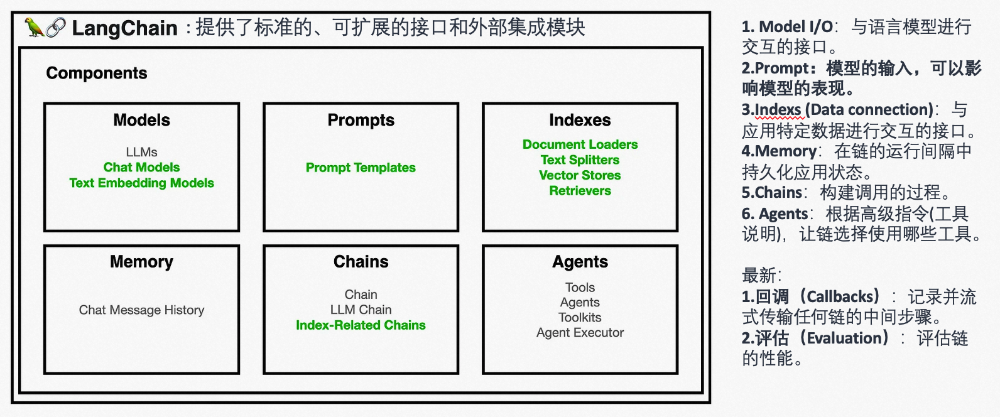


## 三、LangChain主要概念与示例


以下核心部分模块，都有对应的实践代码放在本仓库中，执行代码需要做的一些准备：

- 能访问外网
- 模型使用：申请OpenAPI的Key、申请HuggingFace的Key.
- Google搜素工具：申请SERPAPI。https://serpapi.com/
- 模型调试：注册下WandB账号，复制下key:  https://wandb.ai/site

```
OPENAI_API_KEY=
HUG_API_KEY=
SERPAPI_API_KEY=
WANDB_API_KEY=
```


另外本次案例，一些比较重要的模块安装：

```
pip install openai python-dotenv langchain google-search-results tiktoken sentence_transformers chromadb redis faiss-cpu playwright wandb langflow

```

| 模块                           | 说明                                       | 安装命令                                     |
| ------------------------------ | ------------------------------------------ | -------------------------------------------- |
| openai python-dotenv langchain | 主要的LangChain模块                        | `pip install openai python-dotenv langchain` |
| google-search-results          | 使用Google搜索的接口                       | `pip install google-search-results`          |
| tiktoken                       | 进行summary的时候，需要进行分割            | `pip install tiktoken`                       |
| sentence_transformers          | 进行文本Embedding                          | `pip install sentence_transformers`          |
| chromadb                       | 向量数据库，存储文本嵌入向量               | `pip install chromadb`                       |
| redis                          | 如果chromadb有bug，使用redis存储向量也可以 | `pip install redis`                          |
| faiss-cpu                      | Facebook的相似性向量搜索库                 | `pip install faiss-cpu`                      |
| playwright                     | 浏览器测试工具，Agent测试时候用            | `pip install playwright`                     |
| wandb                          | LangChain调试工具                          | `pip install wandb`                          |
| langflow                       | LangChain可视化配置工具                    | `pip install langflow`                       |


### Model I/O

和大模型交互的部分，LangChain为我们抽象了三个组件，模型输入、模型、模型输出解析器：

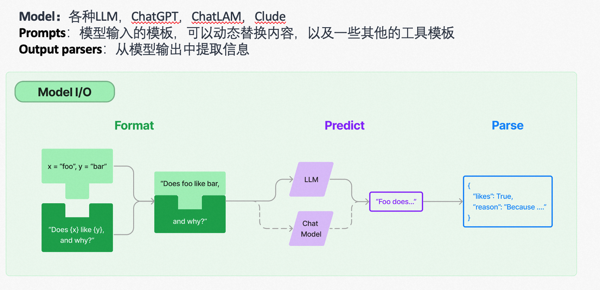


#### Model

LangChain的一个核心价值就是它提供了标准的模型接口；然后我们可以自由的切换不同的模型，当前主要有两种类型的模型，LLMs（语言模型）和Chat Models（聊天模型）.**说到模型，大家就理解模型就是ChatGPT就可以。单纯的模型只能生成文本内容。**

- LLMs：这类模型接受一个文本字符串作为输入，然后返回一个文本字符串作为输出。主要用于文本生成任务

- Chat Models：将聊天消息列表作为输入，并返回一个聊天消息,通常这些消息会标明语言的角色（通常是"System"、"AI"或"Human"），这类模型是基于语言模型的，但是它们被专门调整用于进行对话。


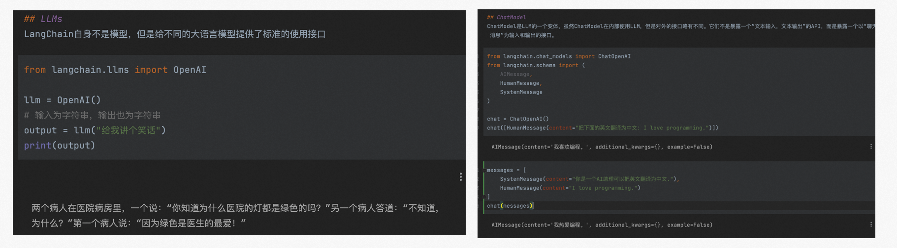


#### Prompt

面向模型编程，其实就是写Prompt。 Prompt是模型的输入，高质量的Prompt对于充分发挥AI的能力至关重要。LangChain提供了两个工具：

- Prompt templates：参数化模板。
- Example selectors: 动态的选择在Prompt中的例子


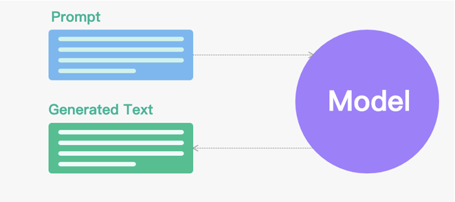


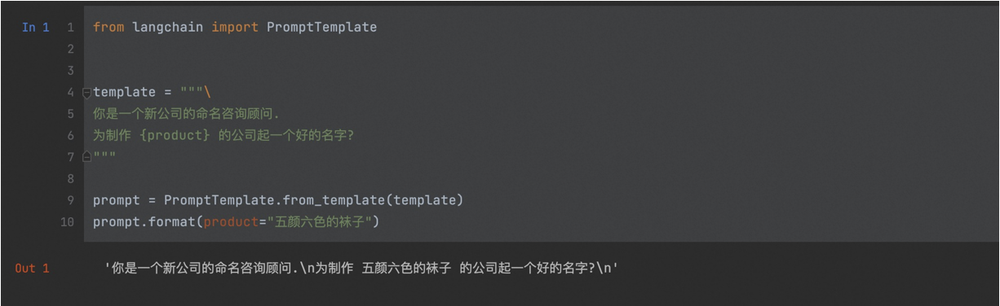


#### Output Parsers

语言模型输出的是文本。但很多时候，我们想要获得更结构化的信息。输出解析器可以帮助我们结构化语言模型的输出。

输出解析器有两个主要方法：

- “获取格式说明(Get format instructions)”：返回一个字符串，告诉语言模型输出应该输出什么格式
- “解析(Parse)”：接受一个字符串（假定为语言模型的响应），并将其解析为某种结构。


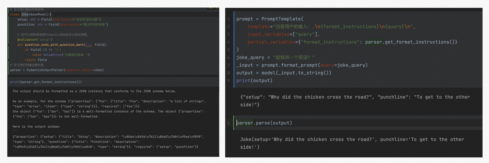


### Data Connection

| 名称                               | 说明                                                         |
| ---------------------------------- | ------------------------------------------------------------ |
| 文档加载器 (Document loaders)      | 用于从各种数据源（如文本文件、网页、视频等）中提取文本数据，并将这些数据以一种标准化的形式（即“文档”）进行管理和使用。 |
| 文档转换器 (Document transformers) | 在加载了文档之后，对它们进行转换，以便更好地适应应用。例如，将一个长文档分割成可以适应模型上下文窗口的小块。 |
| 嵌入 (Embeddings)                  | 将一段文本转化为一个向量表示，可以做一些语义搜索，相似性搜索。在LangChain中，基础的Embeddings类提供了两种方法：嵌入文档和嵌入查询。 |
| 向量存储库 (Vector Store)          | 负责存储嵌入数据并执行向量搜索。查询“最相似”的嵌入向量。     |
| Retriever                          | 一个接口，它可以根据非结构化查询返回文档。它比向量存储更为通用。Retriever不需要存储文档，只需要返回（或检索）文档。向量存储可以作为Retriever的基础。 |

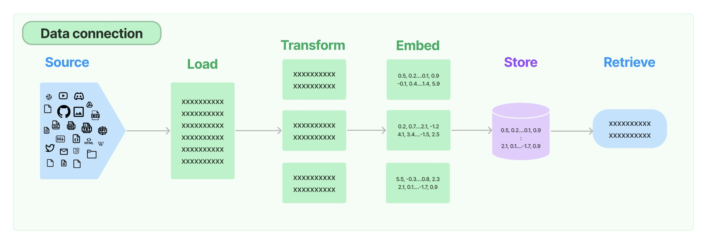


代码案例可以在仓库中看到。


### Chains

Chain是一种用于构建复杂LLM应用的工具，可以将多个语言模型（LLMs）或其他组件链接在一起。
Chain基本的接口包括一个内存（memory）属性，一个回调（callbacks）属性，以及一个__call__方法，这个方法接受输入，返回一个字典。目前内置的几种常用Chain：

- LLMChain：这是一个简单的链，由PromptTemplate和LLM组成，它使用提供的输入键值格式化提示模板，将格式化的字符串传递给LLM，并返回LLM的输出。
- RouterChain：一种创建动态选择给定输入使用的下一个链的链的范例。路由链由两部分组成：RouterChain本身（负责选择要调用的下一个链）和目标链（路由链可以路由到的链）。
- Sequential Chains:
  - SequentialChain：允许有多个输入/输出。顺序链允许你连接多个链并将它们组合成执行某些特定场景的管道。
  - SimpleSequentialChain：每个步骤都有一个单一的输入/输出，一个步骤的输出是下一个步骤的输入。


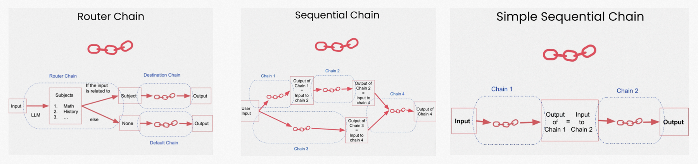


LangChain也已经内置了一些专门用作特定功能的Chain，在处理数据上定义的几种不同形式的Chain_Type。

| 名称                        | 说明                                                         |
| --------------------------- | ------------------------------------------------------------ |
| Stuff Documents Chain       | 这是最直接的文档链。它接收一系列文档，将它们全部插入到一个提示中，然后将该提示传递给一个LLM（Language Model）。这个链适合于文档较小且大多数调用只传入少量文档的应用。 |
| Refine Documents Chain      | 这个链通过循环处理输入文档并迭代更新其答案来构建响应。对于每个文档，它将所有非文档输入、当前文档和最新的中间答案传递给一个LLM链以获取新的答案。这个链适合需要分析比模型上下文可以容纳的更多文档的任务。 |
| Map Reduce Documents Chain  | 这个链首先将一个LLM链单独应用到每个文档上（Map步骤），将链输出视为新的文档。然后，它将所有新的文档传递给一个单独的combine documents链，以获取单一的输出（Reduce步骤）。如果需要，它可以首先压缩或折叠映射的文档，以确保它们适合在combine documents链中。 |
| Map Re-rank Documents Chain | 这个链首先在每个文档上运行一个初始提示，该提示不仅试图完成任务，而且还给出了对其答案的确定程度的评分。返回得分最高的响应。 |

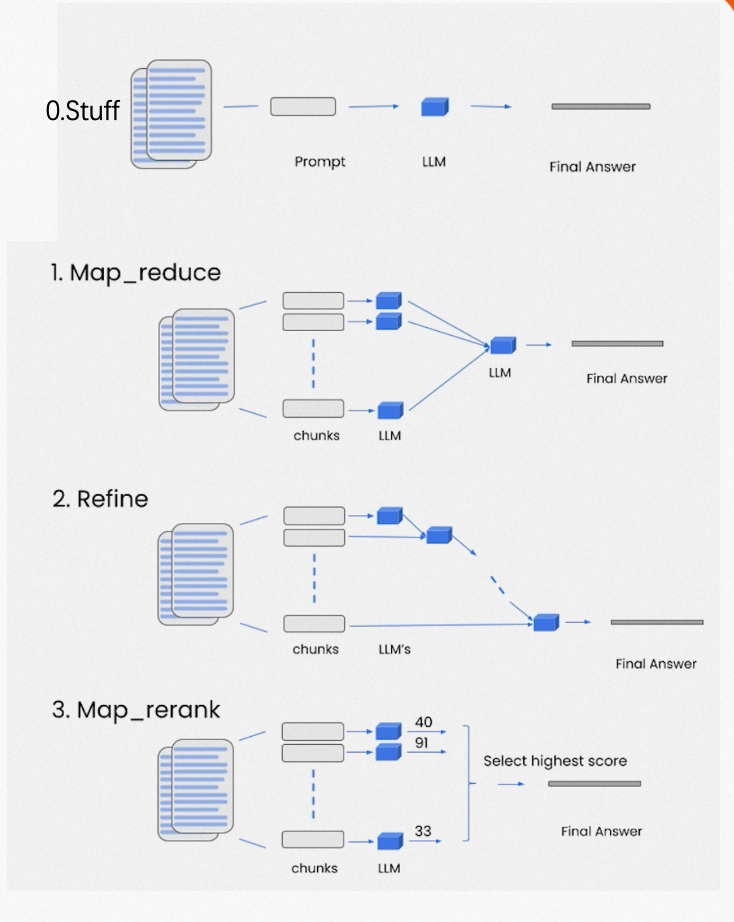


### Memory

Chains和Agents默认是无状态的，也就是每次对话都是独立的。但是在某些应用中，如聊天机器人，记住之前的交互是至关重要的，无论是短期还是长期。这就是Memory的作用。

LangChain也提供一些不同类型的Memory，方便用在不同的场景中，用在Chain或者Agent中；

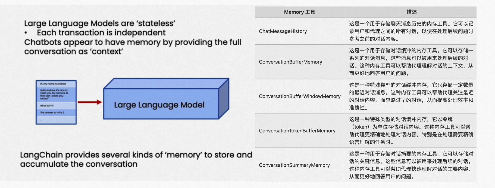


### Agent

Aagent的核心思想是使用语言模型（LLM）来选择要执行的一系列动作。在链（chains）中，动作序列是硬编码的（在代码中）。在agents中，语言模型被用作推理引擎，以确定要执行哪些动作以及执行的顺序。
几个关键组件：
- Agent：这是负责决定下一步要采取什么行动的类。
- Tools：Tools是agent调用的函数。
- Toolkits：用于完成特定目标所需的工具组。一个toolkit通常包含3-5个工具。
- AgentExecutor：AgentExecutor是agent的运行时环境。这是实际调用agent并执行其选择的动作的部分。


Agent根据LLM判断应该采用那个Tool，然后调用Tool，再向用户输出响应。

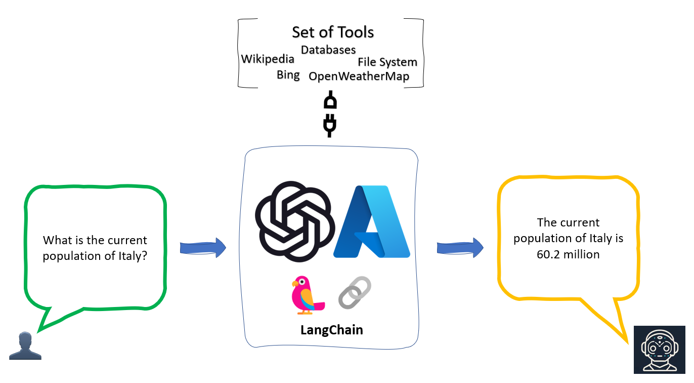

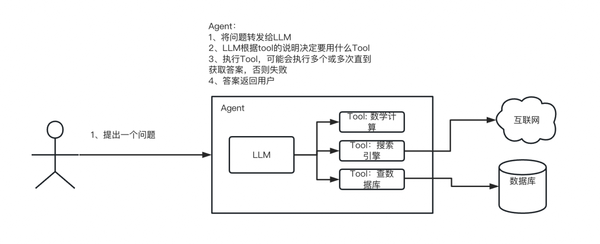


有两种类型的Agent：

1. **动作代理（Action Agents）**：这种代理一次执行一个动作，然后根据结果决定下一步的操作。
2. **计划-执行代理（Plan-and-Execute Agents）**：这种代理首先决定一系列要执行的操作，然后根据上面判断的列表逐个执行这些操作。


在初始化Agent的时候，指定Agent的Type，关于agent的Type。主要会有Action的Agent比较多

```
initialize_agent(tools, llm, agent=AgentType.ZERO_SHOT_REACT_DESCRIPTION, verbose=True)
```

一些Action Agent的类型：

| 名称                      | 说明                                         |
|---------------------------|----------------------------------------------|
| Zero-shot ReAct           | 仅根据工具的描述来确定使用哪个工具。要求为每个Tool提供一个描述，不限制Tool数量。 |
| Structured input ReAct    | 能够使用多输入工具，结构化的参数输入。 |
| Conversational            | 为对话设置设计的Agent，使用Memory来记住之前的对话交互。 |
| Self ask with search      | 自问自答，会使用Google搜索工具。 |
| ReAct document store      | 用于和文档进行交互的Agent。必须提供两个Tool：一个搜索工具和一个查找工具。搜索工具应该搜索文档，而查找工具应该在最近找到的文档中查找一个术语。 |
| OpenAI Functions          | 某些OpenAI模型（如gpt-3.5-turbo-0613和gpt-4-0613）已经明确地进行了微调，如果使用这些模型，可以考虑使用OpenAI Functions 的AgentType。 |


## 四、LangChain应用案例

### LangChain生成图片

实现了一个基于语言模型的文本生成图片工具，调用不同的工具函数来最终生成图片。主要提供了以下几个工具：

1. random_poem：随机返回中文的诗词。
2. prompt_generate：根据中文提示词生成对应的英文提示词。
3. generate_image：根据英文提示词生成对应的图片。


```
import base64
import json
import os
from io import BytesIO

import requests
from PIL import Image
from pydantic import BaseModel, Field

from langchain.agents import AgentType, initialize_agent, load_tools
from langchain.chat_models import ChatOpenAI
from langchain.llms import OpenAI
from langchain.tools import BaseTool, StructuredTool, Tool, tool
from langchain import LLMMathChain, SerpAPIWrapper


def generate_image(prompt: str) -> str:
    """
    根据提示词生成对应的图片

    Args:
        prompt (str): 英文提示词

    Returns:
        str: 图片的路径
    """
    url = "http://127.0.0.1:7860/sdapi/v1/txt2img"
    headers = {
        "accept": "application/json",
        "Content-Type": "application/json"
    }
    data = {
        "prompt": prompt,
        "negative_prompt": "(worst quality:2), (low quality:2),disfigured, ugly, old, wrong finger",
        "steps": 20,
        "sampler_index": "Euler a",
        "sd_model_checkpoint": "cheeseDaddys_35.safetensors [98084dd1db]",
        # "sd_model_checkpoint": "anything-v3-fp16-pruned.safetensors [d1facd9a2b]",
        "batch_size": 1,
        "restore_faces": True
    }

    response = requests.post(url, headers=headers, data=json.dumps(data))

    if response.status_code == 200:
        response_data = response.json()
        images = response_data['images']

        for index, image_data in enumerate(images):
            img_data = base64.b64decode(image_data)
            img = Image.open(BytesIO(img_data))
            file_name = f"image_{index}.png"
            file_path = os.path.join(os.getcwd(), file_name)
            img.save(file_path)
            print(f"Generated image saved at {file_path}")
            return file_path
    else:
        print(f"Request failed with status code {response.status_code}")


def random_poem(arg: str) -> str:
    """
    随机返回中文的诗词

    Returns:
        str: 随机的中文诗词
    """
    llm = OpenAI(temperature=0.9)
    text = """
        能否帮我从中国的诗词数据库中随机挑选一首诗给我，希望是有风景，有画面的诗：
        比如：山重水复疑无路，柳暗花明又一村。
    """
    return llm(text)


def prompt_generate(idea: str) -> str:
    """
    生成图片需要对应的英文提示词

    Args:
        idea (str): 中文提示词

    Returns:
        str: 英文提示词
    """
    llm = OpenAI(temperature=0, max_tokens=2048)
    res = llm(f"""
    Stable Diffusion is an AI art generation model similar to DALLE-2.
    Below is a list of prompts that can be used to generate images with Stable Diffusion:

    - portait of a homer simpson archer shooting arrow at forest monster, front game card, drark, marvel comics, dark, intricate, highly detailed, smooth, artstation, digital illustration by ruan jia and mandy jurgens and artgerm and wayne barlowe and greg rutkowski and zdislav beksinski
    - pirate, concept art, deep focus, fantasy, intricate, highly detailed, digital painting, artstation, matte, sharp focus, illustration, art by magali villeneuve, chippy, ryan yee, rk post, clint cearley, daniel ljunggren, zoltan boros, gabor szikszai, howard lyon, steve argyle, winona nelson
    - ghost inside a hunted room, art by lois van baarle and loish and ross tran and rossdraws and sam yang and samdoesarts and artgerm, digital art, highly detailed, intricate, sharp focus, Trending on Artstation HQ, deviantart, unreal engine 5, 4K UHD image
    - red dead redemption 2, cinematic view, epic sky, detailed, concept art, low angle, high detail, warm lighting, volumetric, godrays, vivid, beautiful, trending on artstation, by jordan grimmer, huge scene, grass, art greg rutkowski
    - a fantasy style portrait painting of rachel lane / alison brie hybrid in the style of francois boucher oil painting unreal 5 daz. rpg portrait, extremely detailed artgerm greg rutkowski alphonse mucha greg hildebrandt tim hildebrandt
    - athena, greek goddess, claudia black, art by artgerm and greg rutkowski and magali villeneuve, bronze greek armor, owl crown, d & d, fantasy, intricate, portrait, highly detailed, headshot, digital painting, trending on artstation, concept art, sharp focus, illustration
    - closeup portrait shot of a large strong female biomechanic woman in a scenic scifi environment, intricate, elegant, highly detailed, centered, digital painting, artstation, concept art, smooth, sharp focus, warframe, illustration, thomas kinkade, tomasz alen kopera, peter mohrbacher, donato giancola, leyendecker, boris vallejo
    - ultra realistic illustration of steve urkle as the hulk, intricate, elegant, highly detailed, digital painting, artstation, concept art, smooth, sharp focus, illustration, art by artgerm and greg rutkowski and alphonse mucha

    I want you to write me a list of detailed prompts exactly about the idea written after IDEA. Follow the structure of the example prompts. This means a very short description of the scene, followed by modifiers divided by commas to alter the mood, style, lighting, and more.

    IDEA: {idea}""")
    return res


class PromptGenerateInput(BaseModel):
    """
    生成英文提示词所需的输入模型类
    """
    idea: str = Field()


class GenerateImageInput(BaseModel):
    """
    生成图片所需的输入模型类
    """
    prompt: str = Field(description="英文提示词")


tools = [
    Tool.from_function(
        func=random_poem,
        name="诗歌获取",
        description="随机返回中文的诗词"
    ),
    Tool.from_function(
        func=prompt_generate,
        name="提示词生成",
        description="生成图片需要对应的英文提示词，当前工具可以将输入转换为英文提示词，以便方便生成",
        args_schema=PromptGenerateInput
    ),
    Tool.from_function(
        func=generate_image,
        name="图片生成",
        description="根据提示词生成对应的图片，提示词需要是英文的，返回是图片的路径",
        args_schema=GenerateImageInput
    ),
]


def main():
    """
    主函数，初始化代理并执行对话
    """
    llm = OpenAI(temperature=0)
    agent = initialize_agent(tools, llm, agent=AgentType.ZERO_SHOT_REACT_DESCRIPTION, verbose=True)
    agent.run("帮我生成一张诗词的图片?")


if __name__ == '__main__':
    main()

```


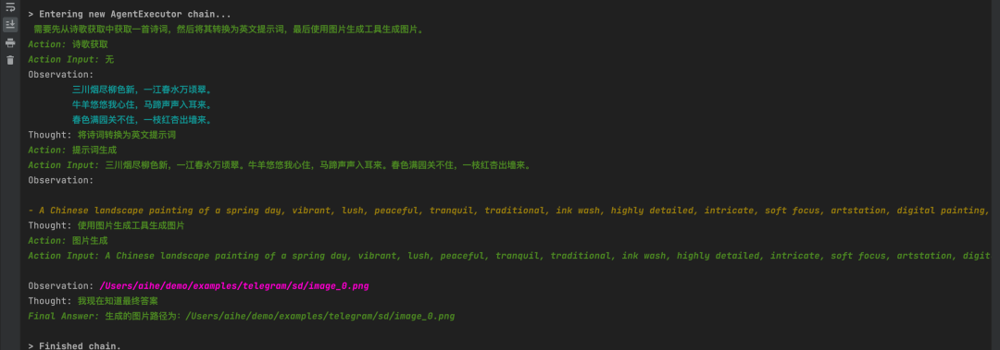


### LangChain做答疑


```
import os
from langchain.chains import RetrievalQA
from langchain.document_loaders import TextLoader
from langchain.embeddings import OpenAIEmbeddings
from langchain.indexes import VectorstoreIndexCreator
from langchain.text_splitter import CharacterTextSplitter
from langchain.vectorstores import Chroma
from langchain.llms import OpenAI

# 设置代理
os.environ['HTTP_PROXY'] = 'socks5h://127.0.0.1:13659'
os.environ['HTTPS_PROXY'] = 'socks5h://127.0.0.1:13659'

# 创建文本加载器
loader = TextLoader('/Users/aihe/Downloads/demo.txt', encoding='utf8')

# 加载文档
documents = loader.load()

# 文本分块
text_splitter = CharacterTextSplitter(chunk_size=1000, chunk_overlap=0)
texts = text_splitter.split_documents(documents)

# 计算嵌入向量
embeddings = OpenAIEmbeddings()

# 创建向量库
db = Chroma.from_documents(texts, embeddings)

# 将向量库转换为检索器
retriever = db.as_retriever()

# 创建检索问答系统
qa = RetrievalQA.from_chain_type(llm=OpenAI(), chain_type="stuff", retriever=retriever)

# 运行问题答案检索
query = "如何申请租户?"
print(qa.run(query))

print(qa.run("能否说明下你可以提供的功能？"))
```


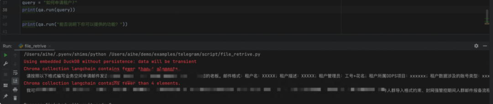


### Langchain输出结构化JSON数据

```
import requests
from langchain.agents import AgentType, initialize_agent
from langchain.chat_models import ChatOpenAI
from langchain.tools import StructuredTool
from pydantic import BaseModel, Field


def post_message(type: str, param: dict) -> str:
    """
     当需要生成人群、分析画像、咨询问题时，使用如下的指示：url 固定为：http://localhost:3001/
     如果请求是生成人群，请求的type为crowd; 如果请求是分析画像，请求的type为analyze; 如果是其他或者答疑，请求的type为question;
     请求body的param把用户指定的条件传进来即可
     """
    result = requests.post("http://localhost:3001/", json={"type": type, "param": param})
    return f"Status: {result.status_code} - {result.text}"


class PostInput(BaseModel):
    # body: dict = Field(description="""格式:{"type":"","param":{}}""")
    type: str = Field(description="请求的类型，人群为crowd,画像为analyze")
    param: dict = Field(description="请求的具体描述")


llm = ChatOpenAI(temperature=0)
tools = [
    StructuredTool.from_function(post_message)
]
agent = initialize_agent(tools, llm, agent=AgentType.STRUCTURED_CHAT_ZERO_SHOT_REACT_DESCRIPTION, verbose=True)
agent.run("我想生成一个性别为男并且在180天访问过淘特的人群?")
```


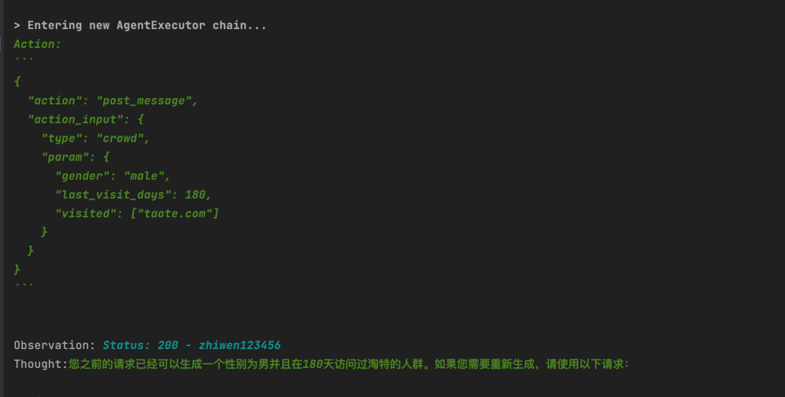


###  LangChain做一款自己的聊天机器人


原本做聊天机器人，需要一些前端代码，但是已经有相应的开源工具，帮我们把LangChian的各种组件做了可视化，直接拖拽即可，我们直接使用LangFlow；

```
pip install langflow
```

然后运行命令：

```
langfow
```

在界面上配置LangChain的三个组件：在最右下角是对应的聊天窗口，输入下openai的key


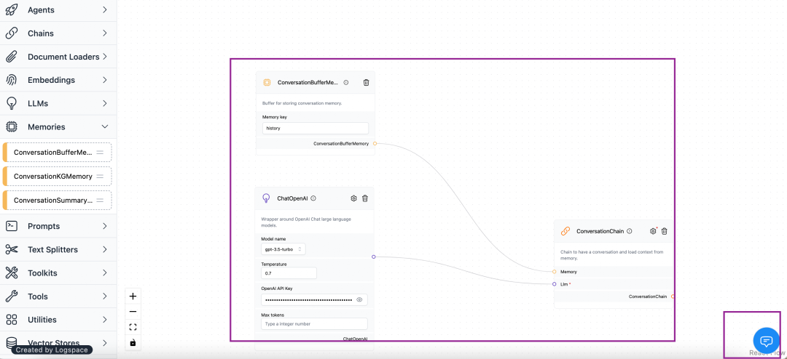


开始聊天验证下我们的配置：

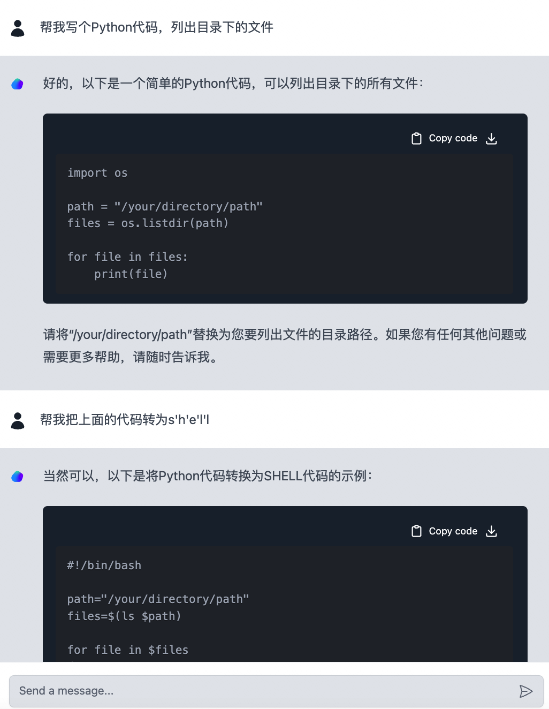


全程基本上不用怎么写代码，只需要了解LangChain的组件是做什么的，基本上就可以搭出一款简单的聊天机器人。


其它的LangChain组件代理，内存，数据索引也是都可以使用的。


### 其它案例

可以参考本仓库的practice目录


## 五、LangChain的未来展望


LangChain为构建基于大型语言模型的应用提供了一个强大的框架，将逐步的运用到各个领域中，如，智能客服、文本生成、知识图谱构建等。随着更多的工具和资源与LangChain进行集成，大语言模型对人的生产力将会有更大的提升。


大模型正处于持续的演进和发展阶段。近期关于大模型的新闻和研究成果层出不穷，这让人联想到早期的芯片技术，其发展方向多样且不断进步。可以预见到的大模型可能的发展：

1. 模型规模持续扩大，以处理更复杂的任务。
2. 模型将能处理多种类型的输入，并能与用户进行更复杂的交互。
3. 模型将具备实时学习和适应新数据的能力，以满足动态环境和需求。
4. 模型的安全性、隐私保护和可解释性将得到更多的关注。
5. 模型将更加个性化和定制化，以满足不同场景的特定需求。


在LangChain方面：

1.LangChain社区活跃度高，生态系统持续完善，提供了越来越多的工具和资源，使我们能更方便地构建大模型应用，这有点像早期的App生态系统。

2.随着大模型的发展，我们将看到更多个性化和定制化的应用，这些应用将跨平台运行，并可能为每个人提供个性化的模型。

3.大模型将融入各种业务中，提升我们的工作效率和产品使用体验。在未来，每个人都可能拥有自己的AI助理。


应用场景构思：

1. **智能客服**：结合聊天模型、自主智能代理和问答功能，开发智能客服系统，帮助用户解决问题，提高客户满意度。
2. **个性化推荐**：利用智能代理与文本嵌入模型，分析用户的兴趣和行为，为用户提供个性化的内容推荐。
3. **知识图谱构建**：通过结合问答、文本摘要和实体抽取等功能，自动从文档中提取知识，构建知识图谱。
4. **自动文摘和关键信息提取**：利用LangChain的文本摘要和抽取功能，从大量文本中提取关键信息，生成简洁易懂的摘要。
5. **代码审查助手**：通过代码理解和智能代理功能，分析代码质量，为开发者提供自动化代码审查建议。
6. **搜索引擎优化**：结合文本嵌入模型和智能代理，分析网页内容与用户查询的相关性，提高搜索引擎排名。
7. **数据分析与可视化**：通过与API交互和查询表格数据功能，自动分析数据，生成可视化报告，帮助用户了解数据中的洞察信息。
8. **智能编程助手**：结合代码理解和智能代理功能，根据用户输入的需求自动生成代码片段，提高开发者的工作效率。
9. **在线教育平台**：利用问答和聊天模型功能，为学生提供实时的学术支持，帮助他们解决学习中遇到的问题。
10. **自动化测试**：结合智能代理和代理模拟功能，开发自动化测试场景，提高软件测试的效率和覆盖率。


## 六、总结


本文介绍了LangChain框架，它能够将大型语言模型与其他计算或知识来源相结合，从而实现功能更加强大的应用。接着，对LangChain的关键概念进行了详细说明，并基于该框架进行了一些案例尝试，旨在帮助读者更轻松地理解LangChain的工作原理。

展望未来，LangChain有望在各个领域发挥巨大作用，促进我们工作效率的变革。我们正处于AI爆发的前夜，积极拥抱新技术将会带来完全不同的感觉。


参考资料：

1. Langchain中文入门：https://github.com/liaokongVFX/LangChain-Chinese-Getting-Started-Guide
2. LangChain官方文档：https://python.langchain.com/en/latest/modules/indexes/getting_started.html
3. LangFlow，LangChain的可视化编排工具：https://github.com/logspace-ai/langflow


## 最后：团队介绍

大淘宝技术用户运营平台技术团队是一支最懂用户，技术驱动的年轻队伍，以用户为中心，通过技术创新提升用户全生命周期体验，持续为用户创造价值。

团队以创新为核心价值观之一，鼓励团队成员在工作中不断探索、实验和创新，以推动业界技术的进步和用户体验的提升。我们不仅关注当前业界领先的技术，更注重未来技术的预研和应用。团队成员会积极参与学术研究和技术社区，不断探索新的技术方向和解决方案。

团队立足体系化打造业界领先的用户增长基础设施，以媒体外投平台、ABTest平台、用户运营平台为代表的基础设施赋能阿里集团用户增长，日均处理数据量千亿规模、调用QPS千万级。在用户增长技术团队，我们提供“增长黑客”极客氛围和丰富的岗位选择，欢迎业界贤才加入。